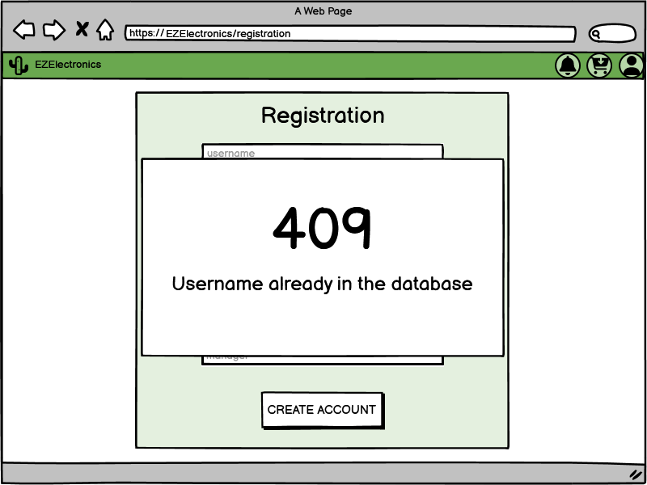
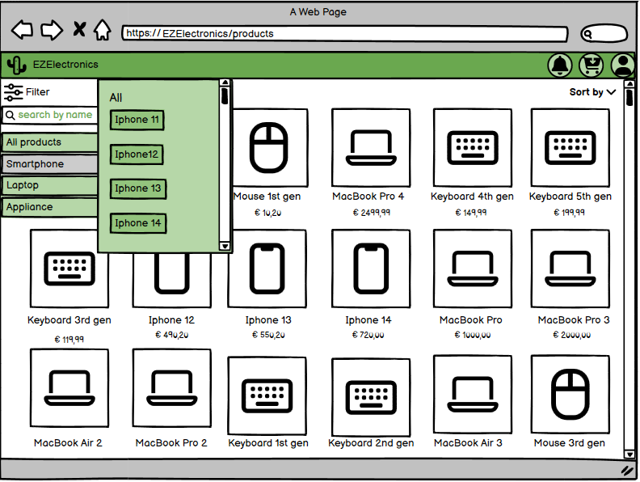
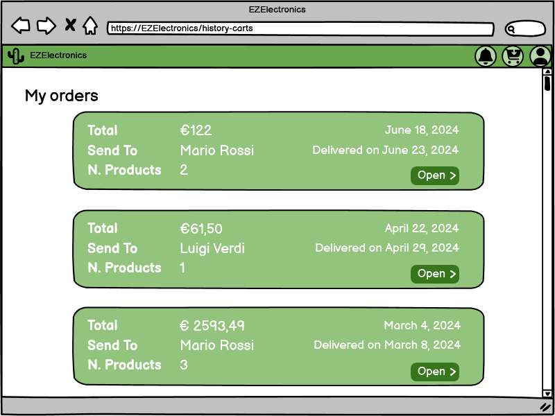

# Graphical User Interface Prototype - FUTURE

Authors:

Date:

Version:

## Visitor
At first when opening the site of EzElettronics it is possible to enter as guest. This means the user can view the products but cannot add them into a cart nor buy them

To do that the user can decide to log in

## Autentication 
In the log in section it is possible to decide if the user wants to log in or, if he has not an account, to register

The username and the password cannot be an empty string

If the user enters a wrong username or password, it will appear an error

If the user does not have an account, he can decide to register

The user specifies the role of his account. If he is a customer, he needs to specify the age

If an already existing user tries to register, it appears an error

## Customer
Once logged in, the customer can view all products. The products not available will appear as out of stock

The customer can check his profile

And view all his informations

The customer can filter the products by category and by model both selecting it from its category and searching its name

The customer can sort the product by price

If the user selects an available product he can view all informations and add it into the cart

The customer can then view the cart and can pay for it or delete the entire cart. The products in the cart will be reserved only for 10 minutes

If he decides to pay for the cart, the customer needs to fill out informations about the address

If the user selects a product which is not available he can decide to ask for a notification for when the product will be available again

So when the product will be available again in the home page it will appear a notification

The customer can also decide to view the history of all carts

And can decide to view a single cart. In this section the customer will be able to rate products he already bought and to request a return

Once the customer is done shopping, he can decide to log out

## Manager
If the user is logged in as manager, he can also view his profile with all his specifications

The manager will see all model of products and its relative informations

Here he can decide to register the arrival of a new set of products

If he is registering a new model, he can add it to the database

And he can delete a product by inserting its code

In this section the manager will be able to add a discount to a model

Which in the customer interface will appear like this

And modify its price

He can also filter the products, by code, model and category

And select a specific product and view it

