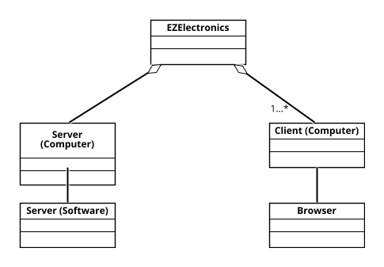
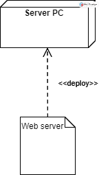

# Requirements Document - current EZElectronics

Date:

Version: V1 - description of EZElectronics in CURRENT form (as received by teachers)

| Version number | Change |
| :------------: | :----: |
|         1       |        |

# Contents

- [Requirements Document - current EZElectronics](#requirements-document---current-ezelectronics)
- [Contents](#contents)
- [Informal description](#informal-description)
- [Stakeholders](#stakeholders)
- [Context Diagram and interfaces](#context-diagram-and-interfaces)
  - [Context Diagram](#context-diagram)
  - [Interfaces](#interfaces)
- [Stories and personas](#stories-and-personas)
- [Functional and non functional requirements](#functional-and-non-functional-requirements)
  - [Functional Requirements](#functional-requirements)
  - [Non Functional Requirements](#non-functional-requirements)
- [Access rights](#access-rights)
- [Use case diagram and use cases](#use-case-diagram-and-use-cases)
  - [Use case diagram](#use-case-diagram)
    - [1 Login](#1-login)
      - [Scenario 1.1](#scenario-11)
      - [Scenario 1.2](#scenario-12)
      - [Scenario 1.3](#scenario-13)
      - [Scenario 1.4](#scenario-14)
    - [2 Logout](#2-logout)
      - [Scenario 2.1](#scenario-21)
      - [Scenario 2.2](#scenario-22)
    - [3 CreateNewAccount](#3-createnewaccount)
      - [Scenario 3.1](#scenario-31)
      - [Scenario 3.2](#scenario-32)
      - [Scenario 3.3](#scenario-33)
    - [4 GetCurrentLoggedUser](#4-getcurrentloggeduser)
      - [Scenario 4.1](#scenario-41)
      - [Scenario 4.2](#scenario-42)
      - [Scenario 4.3](#scenario-43)
    - [5 RegisterNewArrivals](#5-registernewarrivals)
      - [Scenario 5.1](#scenario-51)
      - [Scenario 5.2](#scenario-52)
      - [Scenario 5.3](#scenario-53)
    - [6 MarkProductAsSold](#6-markproductassold)
      - [Scenario 6.1](#scenario-61)
      - [Scenario 6.2](#scenario-62)
      - [Scenario 6.3](#scenario-63)
    - [7 GetAllProducts](#7-getallproducts)
      - [Scenario 7.1](#scenario-71)
      - [Scenario 7.2](#scenario-72)
      - [Scenario 7.3](#scenario-73)
      - [Scenario 7.4](#scenario-74)
    - [8 DeleteProductByCode](#8-deleteproductbycode)
      - [Scenario 8.1](#scenario-81)
      - [Scenario 8.2](#scenario-82)
      - [Scenario 8.3](#scenario-83)
    - [9 CreateNewProduct](#9-createnewproduct)
      - [Scenario 9.1](#scenario-91)
      - [Scenario 9.2](#scenario-92)
      - [Scenario 9.3](#scenario-93)
    - [10 Pay](#10-pay)
      - [Scenario 10.1](#scenario-101)
      - [Scenario 10.2](#scenario-102)
      - [Scenario 10.3](#scenario-103)
    - [11 GetHistoryPaidCarts](#11-gethistorypaidcarts)
      - [Scenario 11.1](#scenario-111)
      - [Scenario 11.2](#scenario-112)
    - [12 RemoveProductFromCart](#12removeproductfromcart)
      - [Scenario 12.1](#scenario-121)
      - [Scenario 12.2](#scenario-122)
      - [Scenario 12.3](#scenario-123)
    - [13 DeleteCart](#13-deletecart)
      - [Scenario 13.1](#scenario-131)
      - [Scenario 13.2](#scenario-132)
      - [Scenario 13.3](#scenario-133)
    - [14 AddProduct](#14-addproduct)
      - [Scenario 14.1](#scenario-141)
      - [Scenario 14.2](#scenario-142)
      - [Scenario 14.3](#scenario-143)
    - [15 GetCart](#15-getcart)
      - [Scenario 15.1](#scenario-151)
      - [Scenario 15.2](#scenario-152)
- [Glossary](#glossary)
- [System Design](#system-design)
- [Deployment Diagram](#deployment-diagram)

# Informal description

EZElectronics (read EaSy Electronics) is a software application designed to help managers of electronics stores to manage their products and offer them to customers through a dedicated website. Managers can assess the available products, record new ones, and confirm purchases. Customers can see available products, add them to a cart and see the history of their past purchases.

# Stakeholders

| Stakeholder name | Description                                         |
| :--------------: | :-------------------------------------------------: |
| Manager          | Individual that needs to manage products in the shop |
| Customer         | Individual that wants to buy products from the shop |

# Context Diagram and interfaces

## Context Diagram

## Interfaces

Manager and Customer will access the system using a GUI. The GUI will be different based on the actor: managers will be able to manage products in stock, while customers will be able to insert products in the cart to buy them later.

|   Actor   | Logical Interface   | Physical Interface |
| :-------: | :---------------:   | :----------------: |
| Manager   | GUI                 | PC / Smartphone                |
| Customer  | GUI                 | PC / Smartphone                |

# Stories and personas

Maria is a middle-age woman that works in an electronics shop. She uses EZElectronics to upload weekly (one or multiple time per week) new products in the system and comunicate the arrival of a specific product in the shop. She also needs to know the current situation of the stock.

Mario is a working student with the passion of tech stuff. He monthly buys new devices and he doesn't have time to do that in person, so he choses EZElectronics to do that wherever he is without losing extra time to reach the shop.

Giovanni in a man in his 30s who works during opening hours of physical shops and needs to be able to buy things online.

# Functional and non functional requirements

## Functional Requirements

|  ID      | Description                                 |
| :---:    | :-----------------------------------------: |
|  FR1     | Handle authentication                       |
|  FR1.2   | Login                                       |
|  FR1.2   | Logout                                      |
|  FR1.3   | Get logged account info                     |
|  FR1.4   | Create new account                          |
|  FR2     | Manage products                             |
|  FR2.1   | Register a new arrival of a set of products |
|  FR2.2   | Mark a product as sold                      |
|  FR2.3   | Request a list of all products              |
|  FR2.4   | Request a product by code                   |
|  FR2.5   | Request a list of products by category      |
|  FR2.6   | Request a list of products by model         |
|  FR2.7   | Delete product by code                      |
|  FR2.8   | Create new product                          |
|  FR3     | Manage cart for logged user                 |
|  FR3.1   | Add product to cart                         |
|  FR3.2   | Pay the cart                                |
|  FR3.3   | Request a list of all paid cart             |
|  FR3.4   | Remove a product from the cart              |
|  FR3.5   | Delete the current unpaid cart              |
|  FR3.6   | Retrieve the cart for the current user      |

## Non Functional Requirements

|   ID    | Type (efficiency, reliability, ..) | Description | Refers to |
| :-----: | :--------------------------------: | :---------: | :-------: |
|  NFR1   | Usability                          | No training needed | Managers/Customers |
|  NFR2   | Efficency                          | Minimizing response not considering the network delay | Managers/Customers |
|  NFR3   | Portability                        | The app should be available at least on the last version of the following browsers (Chrome, Firefox, Safari) |           |
|  NFR4   | Usability                          | The app should be visualized both on mobile devices and PC correctly |           |
|  NFR5   | Reliability                        | Frequent backup |           | 
|  NFR6   | Security                           | Cryptography |           |    
|  NFR7   | Efficency                          | Few interactions | Managers/Customers |    
|  NFR8   | Reliability                        | Less than one bug per year |           |

## Access rights
| Function | Manager | Customer | 
| :-----: | :----------: | :---------: |  
| Login | X | X | 
| Logout | X| X| 
| CreateNewAccount |X |X | 
| GetCurrentLoggedUser |X |X | 
| RegisterNewArrivals |X | | 
| MarkProductAsSold | X | |
| GetProducts  |X |X |
| DeleteProductByCode| X | | 
| CreateNewProduct|X | | |
| Pay| |X | | 
| GetHistoryPaidCarts| |X | | 
| RemoveProductFromCart| |X | 
| DeleteCart| |X | 
| AddProducts| |X | 
| GetCart| | X| 

# Use case diagram and use cases

## Use case diagram

### 1 Login

| Actors Involved  | Manager, Customer |
| :--------------: | :------------------------------------------------------------------: |
|   Precondition   | The user is registred and not logged in |
|  Post condition  | The user is logged in |
| Nominal Scenario | The user wants to log into their account to perform some action |
|     Variants     | - |
|    Exceptions    | The system is unavailable. Wrong credentials have been used. Credentials missing |

##### Scenario 1.1

|  Scenario 1.1  |  |
| :------------: | :------------------------------------------------------------------------: |
|   Precondition   | The user is registred and not logged in |
|  Post condition  | The user is logged in |
|     Step#      |                                Description                                 |
|       1        | The user access EZElectronics |
|       2        | The user insert the credentials |
|       3        | The user is authenticated |

##### Scenario 1.2

|  Scenario 1.2  |  |
| :------------: | :------------------------------------------------------------------------: |
|   Precondition   | The user is registred and not logged in |
|  Post condition  | The user is not logged in |
|     Step#      |                                Description                                 |
|       1        | The user access EZElectronics |
|       2        | The user insert the credentials |
|       3        | The credentials are wrong |

##### Scenario 1.3

|  Scenario 1.3  |  |
| :------------: | :------------------------------------------------------------------------: |
|   Precondition   | The user is registred and not logged in |
|  Post condition  | The user is not logged in |
|     Step#      |                                Description                                 |
|       1        | The user access EZElectronics |
|       2        | EZElectronics is unavailable |

##### Scenario 1.4

|  Scenario 1.4  |  |
| :------------: | :------------------------------------------------------------------------: |
|   Precondition   | The user is registred and not logged in |
|  Post condition  | The user is not logged in |
|     Step#      |                                Description                                 |
|       1        | The user access EZElectronics |
|       2        | The user tries to authenticate |
|       3        | Credentials are missing |

### 2 Logout

| Actors Involved  | Manager, Customer |
| :--------------: | :------------------------------------------------------------------: |
|   Precondition   | The user is logged in |
|  Post condition  | The user is logged out |
| Nominal Scenario | The user needs to log out from the account |
|     Variants     | - |
|    Exceptions    | The system is unavailable. |

##### Scenario 2.1

|  Scenario 2.1  |  |
| :------------: | :------------------------------------------------------------------------: |
|   Precondition   | The user is logged in |
|  Post condition  | The user is logged out |
|     Step#      |                                Description                                 |
|       1        | The user ask to log out |
|       2        | The user is loged out |

##### Scenario 2.2

|  Scenario 2.2  |  |
| :------------: | :------------------------------------------------------------------------: |
|   Precondition   | The user is logged in |
|  Post condition  | The user is not logged out |
|     Step#      |                                Description                                 |
|       1        | The user ask to log out |
|       2        | EZElectronics is unavailable |

### 3 CreateNewAccount

| Actors Involved  | Manager, Customer |
| :--------------: | :------------------------------------------------------------------: |
|   Precondition   | The user is not registered to the system |
|  Post condition  | The user is registered and can now login/out |
| Nominal Scenario | The user needs to use the system in some way (as a manager or customer) |
|     Variants     | - |
|    Exceptions    | The system is unavailable. Username already present |

##### Scenario 3.1

|  Scenario 3.1  |  |
| :------------: | :------------------------------------------------------------------------: |
|   Precondition   | The user is not registered to the system |
|  Post condition  | The user is registered and can now login/out |
|     Step#      |                                Description                                 |
|       1        | The user access EZElectronics |
|       2        | The user insert the data required |
|       3        | The user is registered into the system |

##### Scenario 3.2

|  Scenario 1.2  |  |
| :------------: | :------------------------------------------------------------------------: |
|   Precondition   | The user is not registered to the system |
|  Post condition  | The user is not registered |
|     Step#      |                                Description                                 |
|       1        | The user access EZElectronics |
|       2        | The user insert the data required |
|       3        | The username is already present |
|       4        | The user is not registered |

##### Scenario 3.3

|  Scenario 3.3  |  |
| :------------: | :------------------------------------------------------------------------: |
|   Precondition   | The user is not registered to the system |
|  Post condition  | The user is not registered |
|     Step#      |                                Description                                 |
|       1        | The user access EZElectronics |
|       2        | The system is unavailable |

### 4 GetCurrentLoggedUser

| Actors Involved  | Manager, Customer |
| :--------------: | :------------------------------------------------------------------: |
|   Precondition   | The user is logged in |
|  Post condition  | The system get to know the info about the user |
| Nominal Scenario | The user needs to do some sort of action, and the system needs to know if the user is allowed or not |
|     Variants     | - |
|    Exceptions    | The system is unavailable. The user is not logged in |

##### Scenario 4.1

|  Scenario 4.1  |  |
| :------------: | :------------------------------------------------------------------------: |
|  Precondition  | The user is logged in |
| Post condition | The system get to know info about the user |
|     Step#      |                                Description                                 |
|       1        | The  user is logged in and wants to perform a specific action |
|       2        | The system get info about the user |

##### Scenario 4.2

|  Scenario 4.2  |  |
| :------------: | :------------------------------------------------------------------------: |
|  Precondition  | The user is not logged in |
| Post condition | The system doesn't get info about the user |
|     Step#      |                                Description                                 |
|       1        | The  user is not logged in |
|       2        | The info cannot be retreived |

##### Scenario 4.3

|  Scenario 4.3  |  |
| :------------: | :------------------------------------------------------------------------: |
|  Precondition  | The user is logged in |
| Post condition | The system doesn't get info about the user |
|     Step#      |                                Description                                 |
|       1        | The user try to use EZElectronics |
|       2        | The system is unavailable |

### 5 RegisterNewArrivals

| Actors Involved  | Manager |
| :--------------: | :------------------------------------------------------------------: |
|   Precondition   | The user is logged in as a manager |
|  Post condition  | The set of products is registered in the stock |
| Nominal Scenario | The manager needs to register in the stock a new set of products arrived at the shop |
|     Variants     | - |
|    Exceptions    | The system is unavailable. The arrival date is after the current date |

##### Scenario 5.1

|  Scenario 5.1  |  |
| :------------: | :------------------------------------------------------------------------: |
|  Precondition  | The user is logged as manager |
| Post condition | The new set of product is registered in the stock |
|     Step#      |                                Description                                 |
|       1        | The user sends data about a new set of products to be registered in the stock |
|       2        | The products are registered in the stock |

##### Scenario 5.2

|  Scenario 5.2  |  |
| :------------: | :------------------------------------------------------------------------: |
|  Precondition  | The user is logged as manager |
| Post condition | The new set of product is not registered in the stock |
|     Step#      |                                Description                                 |
|       1        | The user sends data about a new set of products to be registered in the stock |
|       2        | The arrival date is after current date |
|       3        | The set of product is not being registered in the stock|

##### Scenario 5.3

|  Scenario 5.3  |  |
| :------------: | :------------------------------------------------------------------------: |
|  Precondition  | The user is logged in asmanager |
| Post condition | The new set of product is not registered in the stock |
|     Step#      |                                Description                                 |
|       1        | The user try to register the new product |
|       2        | The system is unavailable |

### 6 MarkProductAsSold

| Actors Involved  | Manager |
| :--------------: | :------------------------------------------------------------------: |
|   Precondition   | The user is logged in as a manager |
|  Post condition  | The product is marked as sold |
| Nominal Scenario | The manager needs to sell a product |
|     Variants     | - |
|    Exceptions    | The system is unavailable. Product not represent in the stock. The selling date is after the current date. The selling date is before the product's arrival date. The product has already been sold |

##### Scenario 6.1

|  Scenario 6.1  |  |
| :------------: | :------------------------------------------------------------------------: |
|   Precondition   | The user is logged in as a manager |
|  Post condition  | The product is marked as sold |
|     Step#      |                                Description                                 |
|       1        | The user mark a product as sold |
|       2        | The product is marked as sold |

##### Scenario 6.2

|  Scenario 6.2  |  |
| :------------: | :------------------------------------------------------------------------: |
|   Precondition   | The user is logged in as a manager |
|  Post condition  | The product is not marked as sold |
|     Step#      |                                Description                                 |
|       1        | The user mark a product as sold |
|       2        | The product is not present in the stock/The selling date is after the current date/The selling date is before the product's arrival date/The product is already sold |
|       3        | The product is not marked as sold |

##### Scenario 6.3

|  Scenario 6.3  |  |
| :------------: | :------------------------------------------------------------------------: |
|  Precondition  | The user is logged in as manager |
| Post condition | The product is not marked as sold |
|     Step#      |                                Description                                 |
|       1        | The user try to register the new product |
|       2        | The system is unavailable |

### 7 GetProducts

| Actors Involved  | Manager |
| :--------------: | :------------------------------------------------------------------: |
|   Precondition   | The user is logged in |
|  Post condition  | The user gets a list of the required products |
| Nominal Scenario | The manager needs to know which pructs are registered usig specific filters |
|     Variants     | The user can ask for sold/not sold porducts (filter by category, model, code) |
|    Exceptions    | The system is unavailable. If the product is required by code and not present |

##### Scenario 7.1

|  Scenario 7.1  |  |
| :------------: | :------------------------------------------------------------------------: |
|  Precondition  | The user is logged in |
| Post condition | The user gets a list of the required products |
|     Step#      |                                Description                                 |
|       1        | The user ask for sold/not sold products filter by category/model |
|       2        | The user gets the list of products |

##### Scenario 7.2

|  Scenario 7.2  |  |
| :------------: | :------------------------------------------------------------------------: |
|  Precondition  | The user is logged in |
| Post condition | The user gets the required product |
|     Step#      |                                Description                                 |
|       1        | The user ask for a specific product by code |
|       2        | The user gets the required product |

##### Scenario 7.3

|  Scenario 7.3  |  |
| :------------: | :------------------------------------------------------------------------: |
|  Precondition  | The user is logged in |
| Post condition | The user does not get the required product |
|     Step#      |                                Description                                 |
|       1        | The user ask for a specific product by code |
|       2        | The product doesn't exist |
|       2        | The user doesn't get the required product |

##### Scenario 7.4

|  Scenario 7.4  |  |
| :------------: | :------------------------------------------------------------------------: |
|  Precondition  | The user is logged in |
| Post condition | The user does not get the required products |
|     Step#      |                                Description                                 |
|       1        | The user ask for products/product |
|       2        | The system is unavailable |

### 8 DeleteProductByCode

| Actors Involved  | Manager |
| :--------------: | :------------------------------------------------------------------: |
|   Precondition   | The user is logged in as a manager. The product is present |
|  Post condition  | The selected product is deleted |
| Nominal Scenario | The amnager needs to delete a product |
|     Variants     | - |
|    Exceptions    | The system is unavailable. The product is not present |

##### Scenario 8.1

|  Scenario 8.1  |  |
| :------------: | :------------------------------------------------------------------------: |
|   Precondition   | The user is logged in as a manager. The product is present |
|  Post condition  | The selected product is deleted |
|     Step#      |                                Description                                 |
|       1        | The user delete a product |
|       2        | The product is deleted |

##### Scenario 8.2

|  Scenario 8.2  |  |
| :------------: | :------------------------------------------------------------------------: |
|   Precondition   | The user is logged in as a manager |
|  Post condition  | The selected product is not deleted |
|     Step#      |                                Description                                 |
|       1        | The user delete a product |
|       2        | The product is not present |

##### Scenario 8.3

|  Scenario 8.3  |  |
| :------------: | :------------------------------------------------------------------------: |
|   Precondition   | The user is logged in as a manager |
|  Post condition  | The selected product is not deleted |
|     Step#      |                                Description                                 |
|       1        | The user delete a product |
|       2        | The system is unavailable |

### 9 CreateNewProduct

| Actors Involved  | Manager |
| :--------------: | :------------------------------------------------------------------: |
|   Precondition   | The user is logged as a manager. The product is not present |
|  Post condition  | The new product is registered |
| Nominal Scenario | The manager needs to delete a product |
|     Variants     | - |
|    Exceptions    | The system is unavailable. The product is already present. The arrival date is after the current date. |

##### Scenario 9.1

|  Scenario 9.1  |  |
| :------------: | :------------------------------------------------------------------------: |
|   Precondition   | The user is logged as a manager. The product is not present |
|  Post condition  | The new product is registered |
|     Step#      |                                Description                                 |
|       1        | The user insert data for the new product |
|       2        | The new product is registered in the system |

##### Scenario 9.2

|  Scenario 9.2  |  |
| :------------: | :------------------------------------------------------------------------: |
|   Precondition   | The user is logged as a manager |
|  Post condition  | The new product is not registered |
|     Step#      |                                Description                                 |
|       1        | The user insert data for the new product |
|       2        | The new product is already present in the system / The arrival date is after the current date |
|       3        | The insert data is discarded |

##### Scenario 9.3

|  Scenario 9.3  |  |
| :------------: | :------------------------------------------------------------------------: |
|   Precondition   | The user is logged as a manager |
|  Post condition  | The new product is not registered |
|     Step#      |                                Description                                 |
|       1        | The user insert data for the new product |
|       2        | The system is unavailable |

### 10 Pay

| Actors Involved  | Customer |
| :--------------: | :------------------------------------------------------------------: |
|   Precondition   | The user is logged as a customer |
|  Post condition  | The cart is marked as paid |
| Nominal Scenario | The user wants to pay for the order |
|     Variants     | - |
|    Exceptions    | The system is unavailable. The cart is empty or not present |

##### Scenario 10.1

|  Scenario 10.1  |  |
| :------------: | :------------------------------------------------------------------------: |
|   Precondition   | The user is logged as a customer |
|  Post condition  | The cart is marked as paid |
|     Step#      |                                Description                                 |
|       1        | The user enter the checkout section |
|       2        | The user pays for the cart total |
|       3        | The cart is marked as paid in the current date |

##### Scenario 10.2

|  Scenario 10.2  |  |
| :------------: | :------------------------------------------------------------------------: |
|   Precondition   | The user is logged as a customer |
|  Post condition  | The cart is not marked as paid |
|     Step#      |                                Description                                 |
|       1        | The user enter the checkout section |
|       2        | The cart is empty or not present |

##### Scenario 10.3

|  Scenario 10.3  |  |
| :------------: | :------------------------------------------------------------------------: |
|   Precondition   | The user is logged as a customer |
|  Post condition  | The cart is not marked as paid |
|     Step#      |                                Description                                 |
|       1        | The user tries to enter the checkout section |
|       2        | The system is unavailable |

### 11 GetHistoryPaidCarts

| Actors Involved  | Customer |
| :--------------: | :------------------------------------------------------------------: |
|   Precondition   | The user is logged as a customer |
|  Post condition  | The user gets all the already paid carts |
| Nominal Scenario | The user wants to know for which carts they already paid |
|     Variants     | - |
|    Exceptions    | The system is unavailable. |

##### Scenario 11.1

|  Scenario 11.1  |  |
| :------------: | :------------------------------------------------------------------------: |
|   Precondition   | The user is logged as a customer |
|  Post condition  | The user gets all the already paid carts |
|     Step#      |                                Description                                 |
|       1        | The user enter in the paid checkouts section |
|       2        | The user sees all the previous cart paid |

##### Scenario 11.2

|  Scenario 11.2  |  |
| :------------: | :------------------------------------------------------------------------: |
|   Precondition   | The user is logged as a customer |
|  Post condition  | The user does not get all the paid carts |
|     Step#      |                                Description                                 |
|       1        | The user enter in the paid checkouts section |
|       2        | The system is unavailable |

### 12 RemoveProductFromCart

| Actors Involved  | Customer |
| :--------------: | :------------------------------------------------------------------: |
|   Precondition   | The user is logged as a customer |
|  Post condition  | A product is deleted from the current cart |
| Nominal Scenario | The user wants to delete a product in the current cart |
|     Variants     | - |
|    Exceptions    | The system is unavailable. There is no current cart present |

##### Scenario 12.1

|  Scenario 12.1  |  |
| :------------: | :------------------------------------------------------------------------: |
|   Precondition   | The user is logged as a customer |
|  Post condition  | A product is deleted from the current cart |
|     Step#      |                                Description                                 |
|       1        | The user access the cart |
|       2        | The user remove a product from the cart |

##### Scenario 12.2

|  Scenario 12.2  |  |
| :------------: | :------------------------------------------------------------------------: |
|   Precondition   | The user is logged as a customer |
|  Post condition  | A product is not deleted from the current cart |
|     Step#      |                                Description                                 |
|       1        | The user access the cart |
|       2        | There is no active cart |

##### Scenario 12.3

|  Scenario 12.3  |  |
| :------------: | :------------------------------------------------------------------------: |
|   Precondition   | The user is logged as a customer |
|  Post condition  | A product is not deleted from the current cart |
|     Step#      |                                Description                                 |
|       1        | The user access the cart |
|       2        | The system is unvailable |

### 13 DeleteCart

| Actors Involved  | Customer |
| :--------------: | :------------------------------------------------------------------: |
|   Precondition   | The user is logged as a customer |
|  Post condition  | The current cart is deleted |
| Nominal Scenario | The user wants to delete the current cart |
|     Variants     | - |
|    Exceptions    | The system is unavailable. There is no current cart present |

##### Scenario 13.1

|  Scenario 13.1  |  |
| :------------: | :------------------------------------------------------------------------: |
|   Precondition   | The user is logged as a customer |
|  Post condition  | The current cart is deleted |
|     Step#      |                                Description                                 |
|       1        | The user enter the cart settings |
|       2        | The user chose to delete the cart |
|       3        | The cart is deleted |

##### Scenario 13.2

|  Scenario 13.2  |  |
| :------------: | :------------------------------------------------------------------------: |
|   Precondition   | The user is logged as a customer |
|  Post condition  | The current cart is not deleted |
|     Step#      |                                Description                                 |
|       1        | The user access the cart settings |
|       2        | There is no active cart |

##### Scenario 13.3

|  Scenario 13.3  |  |
| :------------: | :------------------------------------------------------------------------: |
|   Precondition   | The user is logged as a customer |
|  Post condition  | The current cart is not deleted |
|     Step#      |                                Description                                 |
|       1        | The user access the cart settings |
|       2        | The system is unvailable |

### 14 AddProducts

| Actors Involved  | Customer |
| :--------------: | :------------------------------------------------------------------: |
|   Precondition   | The user is logged as a customer |
|  Post condition  | A product is added in the cart |
| Nominal Scenario | The user wants to add a new product in the cart |
|     Variants     | - |
|    Exceptions    | The system is unavailable. The product do not exist, is present in another cart, is already sold |

##### Scenario 14.1

|  Scenario 14.1  |  |
| :------------: | :------------------------------------------------------------------------: |
|   Precondition   | The user is logged as a customer |
|  Post condition  | A product is added in the cart |
|     Step#      |                                Description                                 |
|       1        | The user add a product in the cart |
|       2        | The product is in the user cart |

##### Scenario 14.2

|  Scenario 14.2  |  |
| :------------: | :------------------------------------------------------------------------: |
|   Precondition   | The user is logged as a customer |
|  Post condition  | A product is not added in the cart |
|     Step#      |                                Description                                 |
|       1        | The user add a product in the cart |
|       2        | The product does not exist/is present in another cart/as been already sold |

##### Scenario 14.3

|  Scenario 14.3  |  |
| :------------: | :------------------------------------------------------------------------: |
|   Precondition   | The user is logged as a customer |
|  Post condition  | A product is not added in the cart |
|     Step#      |                                Description                                 |
|       1        | The user tries to add a product in the cart |
|       2        | The system is unvailable |

### 15 GetCart

| Actors Involved  | Customer |
| :--------------: | :------------------------------------------------------------------: |
|   Precondition   | The user is logged as a customer |
|  Post condition  | The current cart is retreived |
| Nominal Scenario | The user wants to know the info about the current cart |
|     Variants     | - |
|    Exceptions    | The system is unavailable |

##### Scenario 15.1

|  Scenario 15.1  |  |
| :------------: | :------------------------------------------------------------------------: |
|   Precondition   | The user is logged as a customer |
|  Post condition  | The current cart is retreived |
|     Step#      |                                Description                                 |
|       1        | The user enter the cart section |
|       2        | The user sees the cart products |

##### Scenario 15.2

|  Scenario 15.2  |  |
| :------------: | :------------------------------------------------------------------------: |
|   Precondition   | The user is logged as a customer |
|  Post condition  | The current cart is not retreived |
|     Step#      |                                Description                                 |
|       1        | The user enter the cart section |
|       2        | The system is unvailable |

# Glossary

The user can be a "Manager", if his purpose is to manage products (sell, add, register...); or it can be a "Customer", if his purpose is to buy products.

The product is something (electronic devices) that can be managed in the virtual shop by the manager or can be bought by the customer.

The cart is a set of products that the customer is willing to buy.

# System Design

# Deployment Diagram

