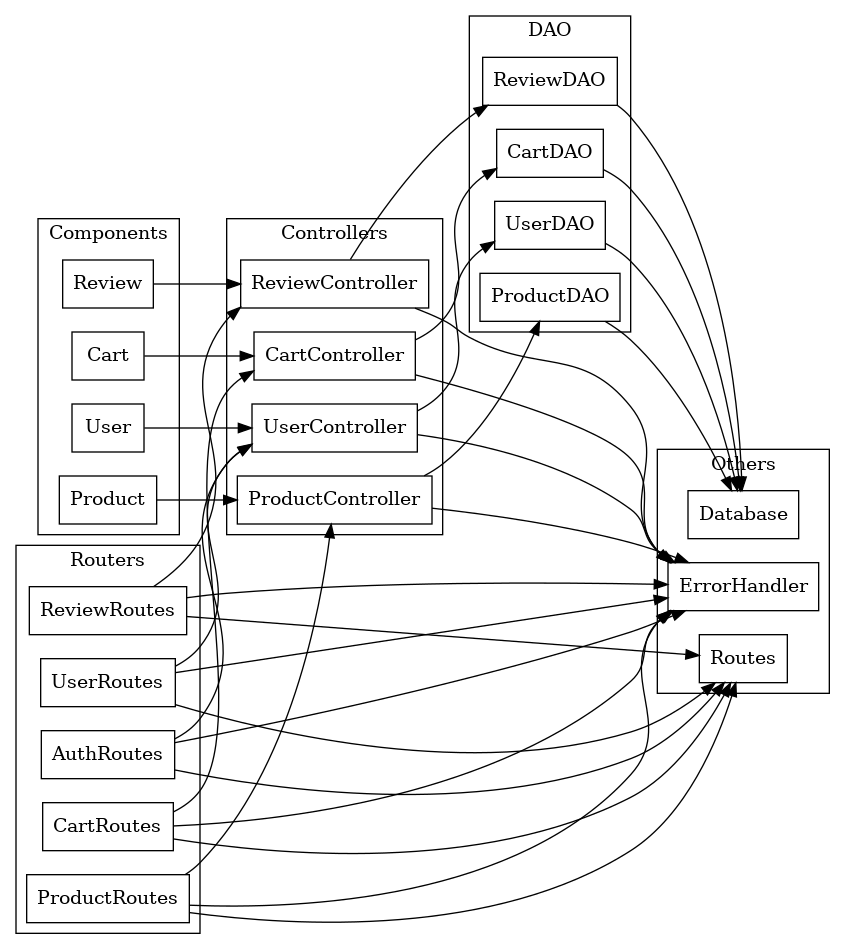
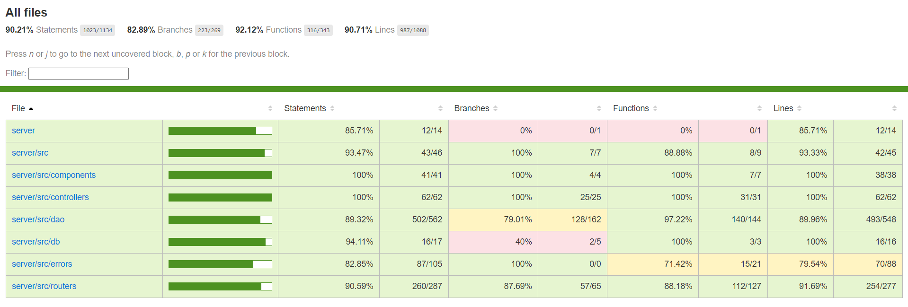

# Test Report

<The goal of this document is to explain how the application was tested, detailing how the test cases were defined and what they cover>

# Contents

- [Test Report](#test-report)
- [Contents](#contents)
- [Dependency graph](#dependency-graph)
- [Integration approach](#integration-approach)
- [Tests](#tests)
- [Coverage](#coverage)
  - [Coverage of FR](#coverage-of-fr)
  - [Coverage white box](#coverage-white-box)

# Dependency graph

   

# Integration approach
  Abbiamo adottato un approccio bottom-up per gli unit test, partendo dalle unità di base e proseguendo verso componenti più complessi. Successivamente, abbiamo eseguito test di integrazione per verificare il funzionamento congiunto dei diversi componenti, includendo DAO, controller e routes.

# Tests

<in the table below list the test cases defined For each test report the object tested, the test level (API, integration, unit) and the technique used to define the test case (BB/ eq partitioning, BB/ boundary, WB/ statement coverage, etc)> <split the table if needed>

| Test case name | Object(s) tested | Test level | Technique used |
| :------------- | :--------------: | :--------: | :------------: |
| should create a new cart if none exists and add product to it | CartController addToCart | Unit | WB/Stmt cov |
| should throw an error if the product do not exist |  | Unit | WB/Stmt cov |
| should throw an error if the product is out of stock |  | Unit | WB/Stmt cov |
| should throw an error if the product is out of stock |  | Unit | WB/Stmt cov |
| should return an empty cart if no cart exists | CartController getCart | Unit | WB/Stmt cov |
| should return a cart with products if a cart is found |  | Unit | WB/Stmt cov |
| should throw an error if the database query fails |  | Unit | WB/Stmt cov |
| should successfully checkout a cart | CartController checkoutCart | Unit | WB/Stmt cov |
| should throw an error if the cart is not found |  | Unit | WB/Stmt cov |
| should throw an error if the cart is empty |  | Unit | WB/Stmt cov |
| should throw an error if the product is low of stock |  | Unit | WB/Stmt cov |
| should throw an error if the database query fails |  | Unit | WB/Stmt cov |
| should return all paid carts for a customer | CartController getCustomerCarts | Unit | WB/Stmt cov |
| should throw an error if the database query fails |  | Unit | WB/Stmt cov |
| should remove a product from the cart | CartController removeProductFromCart | Unit | WB/Stmt cov |
| should throw an error if the product is not found |  | Unit | WB/Stmt cov |
| should throw an error if the cart is not found |  | Unit | WB/Stmt cov |
| should throw an error if the product is not in the cart |  | Unit | WB/Stmt cov |
| should throw an error if the database query fails |  | Unit | WB/Stmt cov |
| should clear the cart | CartController clearCart | Unit | WB/Stmt cov |
| should throw an error if the cart is not found |  | Unit | WB/Stmt cov |
| should throw an error if the database query fails |  | Unit | WB/Stmt cov |
| should delete all carts | CartController deleteAllCarts | Unit | WB/Stmt cov |
| should throw an error if the database query fails |  | Unit | WB/Stmt cov |
| should return a list of all carts | CartController getAllCarts | Unit | WB/Stmt cov |
| should return an empty array if no carts are found |  | Unit | WB/Stmt cov |
| should throw an error if the database query fails |  | Unit | WB/Stmt cov |
| It should return empty Cart | CartDao getCart | Unit | WB/Stmt cov |
| should return a cart with products if a cart is found |  | Unit | WB/Stmt cov |
| should reject if there is an error in the cart query |  | Unit | WB/Stmt cov |
| should reject if there is an error in the cart query |  | Unit | WB/Stmt cov |
| It should reject with ProductNotFoundError if the product does not exist | CartDao addToCart | Unit | WB/Stmt cov |
| It should reject with EmptyProductStockError if the product is out of stock |  | Unit | WB/Stmt cov |
| It should create a new cart if none exists and add product to it |  | Unit | WB/Stmt cov |
| It should add product to an existing cart |  | Unit | WB/Stmt cov |
| It should update quantity if product already exists in cart |  | Unit | WB/Stmt cov |
| It should reject if there is an error in product query |  | Unit | WB/Stmt cov |
| It should reject if there is an error in cart query |  | Unit | WB/Stmt cov |
| It should checkout the cart successfully | CartDao checkoutCart | Unit | WB/Stmt cov |
| It should throw CartNotFoundError if no cart found |  | Unit | WB/Stmt cov |
| It should throw EmptyCartError if the cart is empty |  | Unit | WB/Stmt cov |
| It should throw LowProductStockError if product stock is insufficient |  | Unit | WB/Stmt cov |
| It should return a list of paid carts for the customer | CartDao getCustomerCarts | Unit | WB/Stmt cov |
| It should return an empty array if no paid carts are found |  | Unit | WB/Stmt cov |
| It should throw an error if the database query fails |  | Unit | WB/Stmt cov |
| It should remove a product from the cart successfully | CartDao removeProductFromCart | Unit | WB/Stmt cov |
| It should throw ProductNotFoundError if the product does not exist |  | Unit | WB/Stmt cov |
| It should throw CartNotFoundError if no cart is found |  | Unit | WB/Stmt cov |
| It should throw ProductNotFoundInCartError if the product is not in the cart |  | Unit | WB/Stmt cov |
| It should clear the cart successfully | CartDao clearCart | Unit | WB/Stmt cov |
| It should throw CartNotFoundError if no cart is found |  | Unit | WB/Stmt cov |
| It should throw an error if the database query fails |  | Unit | WB/Stmt cov |
| It should delete all carts successfully | CartDao deleteAllCarts | Unit | WB/Stmt cov |
| It should throw an error if the database query fails |  | Unit | WB/Stmt cov |
| It should return a list of all carts | CartDao getAllCarts | Unit | WB/Stmt cov |
| It should return an empty array if no carts are found |  | Unit | WB/Stmt cov |
| It should throw an error if the database query fails |  | Unit | WB/Stmt cov |
| should get the cart of the logged in customer | CartRoutes GET /carts | API | WB/Stmt cov |
| Should return an empty cart object if there is no unpaid cart in the database. |  | API | WB/Stmt cov |
| Should return an empty cart object if the unpaid cart contains no products. |  | API | WB/Stmt cov |
| Should return a 401 error if the user is not authenticated. |  | API | WB/Stmt cov |
| Should return a 401 error if the user is authenticated but not a customer. |  | API | WB/Stmt cov |
| should add a product to the cart | CartRoutes POST /carts | API | WB/Stmt cov |
| Should increase the quantity of the product if it already exists in the cart. |  | API | WB/Stmt cov |
| Should create a new unpaid cart if none exists and add the product. |  | API | WB/Stmt cov |
| Should return a 404 error if the product model does not exist. |  | API | WB/Stmt cov |
| Should return a 409 error if the product model has an available quantity of 0. |  | API | WB/Stmt cov |
| Should return a 401 error if the user is not authenticated. |  | API | WB/Stmt cov |
| Should return a 401 error if the user is authenticated but not a customer. |  | API | WB/Stmt cov |
| should checkout the cart | CartRoutes PATCH /carts | API | WB/Stmt cov |
| Should update the stock quantities of the products in the cart. |  | API | WB/Stmt cov |
| Should return a 404 error if there is no unpaid cart in the database. |  | API | WB/Stmt cov |
| Should return a 400 error if the unpaid cart contains no products. |  | API | WB/Stmt cov |
| Should return a 409 error if any product in the cart has an available quantity of 0. |  | API | WB/Stmt cov |
| Should return a 409 error if any product in the cart has a quantity higher than available stock. |  | API | WB/Stmt cov |
| Should return a 401 error if the user is not authenticated. |  | API | WB/Stmt cov |
| Should return a 401 error if the user is authenticated but not a customer. |  | API | WB/Stmt cov |
| should get the history of the customer\ | CartRoutes GET /carts/history | API | WB/Stmt cov |
| Should return a 401 error if the user is not authenticated. |  | API | WB/Stmt cov |
| Should return a 401 error if the user is authenticated but not a customer. |  | API | WB/Stmt cov |
| should remove a product from the cart | CartRoutes DELETE /carts/products/:model | API | WB/Stmt cov |
| Should return a 404 error if the product is not in the cart. |  | API | WB/Stmt cov |
| Should return a 404 error if there is no unpaid cart for the user. |  | API | WB/Stmt cov |
| Should return a 404 error if the product model does not exist. |  | API | WB/Stmt cov |
| Should return a 401 error if the user is not authenticated. |  | API | WB/Stmt cov |
| Should return a 401 error if the user is authenticated but not a customer. |  | API | WB/Stmt cov |
| should clear the cart | CartRoutes DELETE /carts/current | API | WB/Stmt cov |
| Should return a 404 error if there is no unpaid cart for the user. |  | API | WB/Stmt cov |
| Should return a 401 error if the user is not authenticated. |  | API | WB/Stmt cov |
| Should return a 401 error if the user is authenticated but not a customer. |  | API | WB/Stmt cov |
| should delete all carts | CartRoutes DELETE /carts | API | WB/Stmt cov |
| Should return a 401 error if the user is not authenticated. |  | API | WB/Stmt cov |
| Should return a 401 error if the user is authenticated but not a manager or an admin |  | API | WB/Stmt cov |
| should get all carts | CartRoutes GET /carts/all | API | WB/Stmt cov |
| Should return a 401 error if the user is not authenticated. |  | API | WB/Stmt cov |
| Should return a 401 error if the user is authenticated but not an admin or manager. |  | API | WB/Stmt cov |
| should add a product to the cart | Cart routes POST /carts | Integration | BlackBox |
| should return 422 if model is empty | POST /carts | Integration | BlackBoxv |
| should return the cart of the logged in customer | Cart routes GET /carts | Integration | BlackBox |
| should return 401 if user is not logged in |  | Integration | BlackBox |
| should checkout the cart | Cart routes PATCH /carts | Integration | BlackBox |
| should return 401 if user is not logged in |  | Integration | BlackBox |
| should return the cart history of the logged in customer | Cart routes GET /carts/history | Integration | BlackBox |
| should return 401 if user is not logged in |  | Integration | BlackBox |
| should remove a product from the cart | Cart routes DELETE /carts/products/:model | Integration | BlackBox |
| should return 422 if model is empty |  | Integration | BlackBox |
| should clear the cart | Cart routes DELETE /carts/current | Integration | BlackBox |
| should return 401 if user is not logged in |  | Integration | BlackBox |
| should retrieve all carts | Cart routes GET /carts/all | Integration | BlackBox |
| should return 401 if user is not logged in |  | Integration | BlackBox |
| should delete all carts | Cart routes DELETE /carts | Integration | BlackBox |
| should return 401 if user is not logged in |  | Integration | BlackBox |
| addReview should return void | ReviewController | Unit | WB/Stmt cov |
| getProductReviews should return all reviews for a product | ReviewController | Unit | WB/Stmt cov |
| deleteReview should return void | ReviewController | Unit | WB/Stmt cov |
| deleteReviewsOfProduct should return void| ReviewController | Unit | WB/Stmt cov |
| deleteAllReviews should return void | ReviewController | Unit | WB/Stmt cov |
| addReview should return 404 if the product does not exist in the database | ReviewDAO | Unit | WB/Stmt cov | 
| addReview should return 409 if there is already a review by the customer | ReviewDAO | Unit | WB/Stmt cov |
| addReview should resolve void when a review is successfully added | ReviewDAO | Unit | WB/Stmt cov |
| addReview should reject with an error if there is an error in the database query | ReviewDAO | Unit | WB/Stmt cov |
| addReview should throw an error if the database crashes | ReviewDAO | Unit | WB/Stmt cov |
| addReview should throw an error if there is a database error | ReviewDAO | Unit | WB/Stmt cov |
| getProductReviews should return 404 if the product does not exist in the database | ReviewDAO | Unit | WB/Stmt cov |
| getProductReviews should return an array of reviews made for a specific product | ReviewDAO | Unit | WB/Stmt cov |
| getProductReviews should reject with an error if there is an error in the database query | ReviewDAO | Unit | WB/Stmt cov |
| getProductReviews should throw an error if the database crashes | ReviewDAO | Unit | WB/Stmt cov |
| getProductReviews should throw an error if there is a database error | ReviewDAO  | Unit | WB/Stmt cov |
| deleteReview should return 404 if the product does not exist in the database | ReviewDAO | Unit | WB/Stmt cov |
| deleteReview should return 404 if the product has not been reviewed by the user | ReviewDAO  | Unit | WB/Stmt cov |
| deleteReview should resolve void when a review made by the current user for a specific product is successfully deleted | ReviewDAO | Unit | WB/Stmt cov |
| deleteReview should reject with an error if there is an error in the database query | ReviewDAO | Unit | WB/Stmt cov |
| deleteReview should throw an error if the database crashes | ReviewDAO | Unit | WB/Stmt cov |
| deleteReview should throw an error if there is a database error | ReviewDAO | Unit | WB/Stmt cov |
| deleteReviewsOfProduct should return 404 if the product does not exist in the database | ReviewDAO | Unit| WB/Stmt cov |
| deleteReviewsOfProduct should resolve void when all reviews of a specific product are successfully deleted | ReviewDAO | Unit | WB/Stmt cov |
| deleteReviewsOfProduct should reject with an error if there is an error in the database query | ReviewDAO | Unit | WB/Stmt cov |
| deleteReviewsOfProduct should throw an error if the database crashes | ReviewDAO | Unit | WB/Stmt cov |
| deleteReviewsOfProduct should throw an error if there is a database error | ReviewDAO | Unit | WB/Stmt cov |
| deleteAllReviews should resolve void when all reviews are successfully deleted | ReviewDAO  | Unit | WB/Stmt cov |
| deleteAllReviews should reject with an error if there is an error in the database query | ReviewDAO  | Unit | WB/Stmt cov |
| deleteAllReviews should throw an error if the database crashes | ReviewDAO | Unit | WB/Stmt cov |
| deleteAllReviews should throw an error if there is a database error | ReviewDAO | Unit | WB/Stmt cov | 
| POST should return a 200 success code if a review to a product id added | ReviewRoutes | API | Black Box |
| POST should resolve a 503 if the database is down | ReviewRoutes | API | Black Box |
| POST should return a 401 error if the user is authenticated but not a Customer | ReviewRoutes | API | Black Box |
| POST should return a 401 error if the user is not authenticated | ReviewRoutes | API | Black Box |
| POST should return a 422 error if the model parameter is an empty string | ReviewRoutes | API | Black Box |
| POST should return a 400 error if the score parameter is not an integer between 1 and 5 | ReviewRoutes | API | Black Box |
| POST should return a 400 error if the comment parameter is an empty string | ReviewRoutes | API | Black Box |
| GET should return a 200 success code for retrieving all reviews of a product | ReviewRoutes | API | Black Box |
| GET should return a 401 error if the user is not authenticated | ReviewRoutes | API | Black Box |
| GET should return a 422 error if the model parameter is an empty string | ReviewRoutes | API | Black Box |
| GET should resolve a 503 if the database is down | ReviewRoutes | API | Black Box |
| DELETE /reviews/model should return a 200 success code if the review made by a user of a product is deleted | ReviewRoutes | API | Black Box |
| DELETE /reviews/model should resolve a 503 if the database is down | ReviewRoutes | API | Black Box |
| DELETE /reviews/model should return a 401 error if the user is authenticated but not a Customer | ReviewRoutes | API | Black Box |
| DELETE /reviews/model should return a 401 error if the user is not authenticated | ReviewRoutes | API | Black Box |
| DELETE /reviews/model/all should return a 200 success code if all the reviews of a specific product are deleted | ReviewRoutes | API | Black Box |
| DELETE /reviews/model/all should resolve a 503 if the database is down | ReviewRoutes | API | Black Box |
| DELETE /reviews/model/all should return a 401 error if the user is not authenticated | ReviewRoutes | API | Black Box |
| DELETE /reviews/model/all should return a 401 error if the user is authenticated but not an Admin or a Manager | ReviewRoutes | API | Black Box |
| DELETE /reviews should return a 200 success code if all the reviews of all products are deleted | ReviewRoutes | API | Black Box |
| DELETE /reviews should resolve a 503 if the database is down | ReviewRoutes | API | Black Box |
| DELETE /reviews should return a 401 error if the user is not authenticated | ReviewRoutes | API | Black Box |
| DELETE /reviews should return a 401 error if the user is authenticated but not an Admin or a Manager | ReviewRoutes | API | Black Box |
| POST should create a new review| ReviewRoutes | Integration | Black Box |
| POST should return 422 if model is empty | ReviewRoutes | Integration | Black Box |
| POST should return 401 if user is not logged in | ReviewRoutes | Integration | Black Box |
| POST should return a ProductNotFoundError if the product does not exist | ReviewRoutes | Integration | Black Box |
| POST should return a ExistingReviewError if there is an existing review for the product made by the customer | ReviewRoutes | Integration | Black Box |
| POST should return a 401 error code if the user is not a Customer | ReviewRoutes | Integration | Black Box |
| POST should return a 422 error code if the score is not between 1 and 5 | ReviewRoutes | Integration | Black Box |
| POST should return 422 if comment is an empty string | ReviewRoutes | Integration | Black Box |
| GET should get all reviews for a product| ReviewRoutes | Integration | Black Box |
| GET should return 422 if model is empty | ReviewRoutes | Integration | Black Box |
| GET should return 401 if user is not logged in | ReviewRoutes | Integration | Black Box |
| GET Should return a ProductNotFoundError if the product does not exist | ReviewRoutes | Integration | Black Box |
| DELETE /reviews/model should delete the review made by a user for one product | ReviewRoutes | Integration | Black Box |
| DELETE /reviews/model should return 401 if user is not logged in | ReviewRoutes | Integration | Black Box |
| DELETE /reviews/model should return a ProductNotFoundError if the product does not exist | ReviewRoutes | Integration | Black Box |
| DELETE /reviews/model should return a NoReviewProductError if the current user does not have a review for the product | ReviewRoutes | Integration | Black Box |
| DELETE /reviews/model should return a 401 error code if the user is not a Customer | ReviewRoutes | Integration | Black Box |
| DELETE /reviews/model/all should delete all reviews for a product | ReviewRoutes | Integration | Black Box |
| DELETE /reviews/model/all should return 401 if user is not logged in | ReviewRoutes | Integration | Black Box |
| DELETE /reviews/model/all should return a ProductNotFoundError if the product does not exist | ReviewRoutes | Integration | Black Box |
| DELETE /reviews/model/all should return a 401 error code if the user is not an Admin or a Manager | ReviewRoutes | Integration | Black Box |
| DELETE /reviews should delete all reviews| ReviewRoutes | Integration | Black Box |
| DELETE /reviews should return 401 if user is not logged in | ReviewRoutes | Integration | Black Box |
| DELETE /reviews should return a 401 error code if the user is not an Admin or a Manager | ReviewRoutes | Integration | Black Box |
| It should resolve true | UserDAO createUser | Unit | WB/Stmt cov |
| It should reject an UserAlreadyExistsError | UserDAO createUser | Unit | WB/Stmt cov |
| DB crashed | UserDAO createUser | Unit | WB/Stmt cov |
| getIsUserAuthenticated - success | UserDAO getIsUserAuthenticated | Unit | WB/Stmt cov |
| getIsUserAuthenticated - error no username | UserDAO getIsUserAuthenticated | Unit | WB/Stmt cov |
| getIsUserAuthenticated - error wrong password | UserDAO getIsUserAuthenticated | Unit | WB/Stmt cov |
| getIsUserAuthenticated DB Error | UserDAO getIsUserAuthenticated | Unit | WB/Stmt cov |
| getIsUserAuthenticated DB Crashed | UserDAO getIsUserAuthenticated | Unit | WB/Stmt cov |
| It should resolve a user customer | UserDAO getUserByUsername | Unit | WB/Stmt cov |
| It should reject an UserNotFoundError | UserDAO getUserByUsername | Unit | WB/Stmt cov |
| DB crashed | UserDAO getUserByUsername | Unit | WB/Stmt cov |
| DB error | UserDAO getUserByUsername | Unit | WB/Stmt cov |
| It should resolve an array of users | UserDAO getUsers | Unit | WB/Stmt cov |
| It should resolve an empty array if there are no users | UserDAO getUsers | Unit | WB/Stmt cov |
| DB crashed | UserDAO getUsers | Unit | WB/Stmt cov |
| DB error | UserDAO getUsers | Unit | WB/Stmt cov |
| It should resolve an array of users with the given role | UserDAO getListUsersByRole | Unit | WB/Stmt cov |
| It should resolve an empty array if there are no users with the given role | UserDAO getListUsersByRole | Unit | WB/Stmt cov |
| DB crashed | UserDAO getListUsersByRole | Unit | WB/Stmt cov |
| DB error | UserDAO getListUsersByRole | Unit | WB/Stmt cov |
| It should resolve true if the user has been deleted | UserDAO deleteUser | Unit | WB/Stmt cov |
| It should reject an UserNotFoundError if the user does not exist | UserDAO deleteUser | Unit | WB/Stmt cov |
| Db crashed in get | UserDAO deleteUser | Unit | WB/Stmt cov |
| Db crashed in run | UserDAO deleteUser | Unit | WB/Stmt cov |
| DB error | UserDAO deleteUser | Unit | WB/Stmt cov |
| It should resolve true if all non-Admin users have been deleted | UserDAO deleteAll | Unit | WB/Stmt cov |
| Db crashed | UserDAO deleteAll | Unit | WB/Stmt cov |
| DB error | UserDAO deleteAll | Unit | WB/Stmt cov |
| It should resolve true if there are no non-Admin users | UserDAO deleteAll | Unit | WB/Stmt cov |
| Should update user info successfully | UserDAO updateUserInfo | Unit | WB/Stmt cov |
| Should reject an UserNotFoundError if the user does not exist | UserDAO updateUserInfo | Unit | WB/Stmt cov |
| DB crashed in get 1 | UserDAO updateUserInfo | Unit | WB/Stmt cov |
| DB crashed in get 2 | UserDAO updateUserInfo | Unit | WB/Stmt cov |
| DB error 1 | UserDAO updateUserInfo | Unit | WB/Stmt cov |
| DB error 2 | UserDAO updateUserInfo | Unit | WB/Stmt cov |
| It should return true | UserController createUser | Unit | WB/Stmt cov |
| It should throw an user already exists error | UserController createUser | Unit | WB/Stmt cov |
| It should throw an error if the creation fails | UserController createUser | Unit | WB/Stmt cov |
| It should return an array of users | UserController getUsers | Unit | WB/Stmt cov |
| It should return an empty array if there are no users | UserController getUsers | Unit | WB/Stmt cov |
| It should throw an error if the retrieval fails | UserController getUsers | Unit | WB/Stmt cov |
| It should return an array of users | UserController getUsersByRole | Unit | WB/Stmt cov |
| It should return an empty array if there are no users with the specified role | UserController getUsersByRole | Unit | WB/Stmt cov |
| It should throw an error if the retrieval fails | UserController getUsersByRole | Unit | WB/Stmt cov |
| It should return a user | UserController getUserByUsername | Unit | WB/Stmt cov |
| It should return a user if the user is an admin and tries to access another user's information | UserController getUserByUsername | Unit | WB/Stmt cov |
| It should return an UnauthorizedUserError if the user is not an admin and tries to access another user's information | UserController getUserByUsername | Unit | WB/Stmt cov |
| It should throw an error if the user is not found | UserController getUserByUsername | Unit | WB/Stmt cov |
| It should throw an error if the retrieval fails | UserController getUserByUsername | Unit | WB/Stmt cov |
| It should delete themselves | UserController deleteUser | Unit | WB/Stmt cov |
| It should delete another user if the user is an admin | UserController deleteUser | Unit | WB/Stmt cov |
| It should throw an UnauthorizedUserError if the user is not an admin and tries to delete another user | UserController deleteUser | Unit | WB/Stmt cov |
| It should throw an UserIsAdminError if the user is an admin and try to delete an other admin | UserController deleteUser | Unit | WB/Stmt cov |
| It should throw an error if the deletion fails | UserController deleteUser | Unit | WB/Stmt cov |
| It should throw an error if the user is not found | UserController deleteUser | Unit | WB/Stmt cov |
| It should return true | UserController deleteAll | Unit | WB/Stmt cov |
| It should throw an error if the deletion fails | UserController deleteAll | Unit | WB/Stmt cov |
| It should return the updated user called by a non admin | UserController updateUserInfo | Unit | WB/Stmt cov |
| It should return the updated user called by an admin to update a non-admin | UserController updateUserInfo | Unit | WB/Stmt cov |
| It should throw an UnauthorizedUserError if the user is not an admin and tries to update another user | UserController updateUserInfo | Unit | WB/Stmt cov |
| It should throw an UnauthorizedUserError if the user is an admin and tries to update another admin | UserController updateUserInfo | Unit | WB/Stmt cov |
| It should throw an error if the update fails | UserController updateUserInfo | Unit | WB/Stmt cov |
| It should return a 200 success code | UserRoutes | API | Blackbox |
| It should return a 409 error code if the user already exists | UserRoutes | API | Blackbox |
| It should return a 400 error code if the role is invalid | UserRoutes | API | Blackbox |
| It should return a 400 error code if any required field is missing | UserRoutes | API | Blackbox |
| It should return a 503 error code if createUser throws a generic error | UserRoutes | API | Blackbox |
| should get the list of users for the logged-in admin | UserRoutes | API | Blackbox |
| should return 401 Forbidden for non-admin user | UserRoutes | API | Blackbox |
| should return 503 Internal Server Error for server issues | UserRoutes | API | Blackbox |
| should get the list of users for a valid role for the logged-in admin | UserRoutes | API | Blackbox |
| should return 422 for an invalid role | UserRoutes | API | Blackbox |
| should return 401 for a non-admin user | UserRoutes | API | Blackbox |
| should return 503 if getUsersByRole fails | UserRoutes | API | Blackbox |
| should get the list of users for the logged-in admin | UserRoutes | API | Blackbox |
| should return 401 Forbidden for non-admin user | UserRoutes | API | Blackbox |
| should return 503 Internal Server Error for server issues | UserRoutes | API | Blackbox |
| should get the list of users for a valid role for the logged-in admin | UserRoutes | API | Blackbox |
| should return 422 for an invalid role | UserRoutes | API | Blackbox |
| should return 401 for a non-admin user | UserRoutes | API | Blackbox |
| should return 503 if getUsersByRole fails | UserRoutes | API | Blackbox |
| It should resolve a 200 if a username exists in the database and an admin tries to retrieve info about another user | UserRoutes | API | Blackbox |
| It should resolve a 200 if a username exists in the database and a non-admin user tries to retrieve info about himself | UserRoutes | API | Blackbox |
| It should resolve a 400 error if the username is an empty string | UserRoutes | API | Blackbox |
| It should resolve a 404 if a username does not exist in the database | UserRoutes | API | Blackbox |
| It should resolve a 401 if a user is not an admin | UserRoutes | API | Blackbox |
| It should resolve a 503 if the database is down | UserRoutes | API | Blackbox |
| It should resolve a 200 if a username exists in the databasecalled by an admin to delete another user | UserRoutes | API | Blackbox |
| It should resolve a 200 if a username exists in the database and a non-admin user tries to delete himself | UserRoutes | API | Blackbox |
| It should resolve a 400 error if the username is an empty string | UserRoutes | API | Blackbox |
| It should resolve a 401 if a user is not an admin and tries to delete another user | UserRoutes | API | Blackbox |
| It should resolve a 401 if a user is an admin and tries to delete another admin | UserRoutes | API | Blackbox |
| It should resolve a 404 if a username does not exist in the database | UserRoutes | API | Blackbox |
| It shoukd resolve a 401 if the user is not logged in | UserRoutes | API | Blackbox |
| It should resolve a 401 if a user is not an admin | UserRoutes | API | Blackbox |
| It should resolve a 503 if the database is down | UserRoutes | API | Blackbox |
| It should resolve a 200 if a user is logged in | UserRoutes | API | Blackbox |
| It should resolve a 401 if a user is not logged in | UserRoutes | API | Blackbox |
| It should resolve a 401 if a user is not an admin | UserRoutes | API | Blackbox |
| It should resolve a 503 if the database is down | UserRoutes | API | Blackbox |
| It should resolve a 200 if a username exists in the database and return the modified user, called by an admin | UserRoutes | API | Blackbox |
| It should resolve a 200 if a username exists in the database and return himself, called by customer or manager | UserRoutes | API | Blackbox |
| It should resolve a 401 if a user is not logged in | UserRoutes | API | Blackbox |
| It should resolve a 401 if a user is not an admin and tries to modify another user | UserRoutes | API | Blackbox |
| It should resolve a 401 if a user is admin and tries to modify another admin | UserRoutes | API | Blackbox |
| It should resolve a 400 error if any of the fields is empty | UserRoutes | API | Blackbox |
| It should resolve a 400 error if the birthdate is after the current date | UserRoutes | API | Blackbox |
| It should resolve a 404 if a username does not exist in the database | UserRoutes | API | Blackbox |
| should return 503 if getUsersByRole fails | UserRoutes | API | Blackbox |
| Create a new user | User routes | Integration | Black Box |
| Return 200 success code and create a new user | User routes | Integration | Black Box |
| Return a 422 error code if at least one request body parameter is empty/missing | User routes | Integration | Black Box |
| Return an array of users | User routes | Integration | Black Box |
| Return a 401 error code if the user is not an Admin | User routes | Integration | Black Box |
| Return an array of users with a specific role | User routes | Integration | Black Box |
| Delete a user | User routes | Integration | Black Box |
| Delete all users if the user calling is an Admin | User routes | Integration | Black Box |
| Return a 401 error code if the user is not an Admin | User routes | Integration | Black Box |
| Update user info - USER UPDATE HIS INFO | User routes | Integration | Black Box |
| It should return undefined if the new Products are inserted|ProductDAO registerNewProductsSet| Unit | WB/Stmt cov
| It should return a ProductAlreadyExistsError if the product already exists|ProductDAO registerNewProductsSet|Unit|WB/Stmt cov
| It should reject if there is an error in the query|ProductDAO registerNewProductsSet| Unit | WB/Stmt cov
|It should return a DateAfterError if the date is wrong|ProductDAO registerNewProductsSet| Unit | WB/Stmt cov
| DB Error|ProductDAO registerNewProductsSet| Unit | WB/Stmt cov
|It should return a number if the product quantity is increased|ProductDAO increaseProductQuantity|Unit|WB/Stmt cov
|It should return a ProductNotFoundError if the product is not found|ProductDAO increaseProductQuantity|Unit|WB/Stmt cov
|It should return a DateBeforeError if the date is wrong|ProductDAO increaseProductQuantity|Unit|WB/Stmt cov
|It should return a DateAfterError if the date is wrong|ProductDAO increaseProductQuantity|Unit|WB/Stmt cov
|It should reject if there is an error in the query|ProductDAO increaseProductQuantity|Unit|WB/Stmt cov
|It should reject if there is an error in the query|ProductDAO increaseProductQuantity|Unit|WB/Stmt cov
|It should return a number if the product quantity is decreased|ProductDAO decreaseProductQuantity|Unit|WB/Stmt cov
|It should return a DateAfterError if the date is wrong|ProductDAO decreaseProductQuantity|Unit|WB/Stmt cov
|It should return a ProductNotFoundError if the product is not found|ProductDAO decreaseProductQuantity|Unit|WB/Stmt cov
|It should return a DateBeforeError if the date is wrong|ProductDAO decreaseProductQuantity|Unit|WB/Stmt cov
|It should reject if there is an error in the query|ProductDAO decreaseProductQuantity|Unit|WB/Stmt cov
|It should reject if there is an error in the query|ProductDAO decreaseProductQuantity|Unit|WB/Stmt cov
|It should return an empty vector of products|ProductDAO getProducts|Unit|WB/Stmt cov
| It should return two products|ProductDAO decreaseProductQuantity|Unit|WB/Stmt cov
|It should reject if there is an error in the product query|ProductDAO decreaseProductQuantity|Unit|WB/Stmt cov
It should return an array of products when products with the given model exists|ProductDAO decreaseProductQuantity|Unit|WB/Stmt cov
|It should reject with ProductNotFoundError if no products with the given model are found|ProductDAO decreaseProductQuantity|Unit|WB/Stmt cov
|It should reject with an error if there is an error in the database query|ProductDAO decreaseProductQuantity|Unit|WB/Stmt cov
|It should return an array of products when products with the given category exist|ProductDAO getProductsByCategory| Unit |WB/Stmt cov
|It should reject with ProductNotFoundError if no products with the given category |ProductDAO getProductsByCategory| Unit |WB/Stmt covare found
|It should reject with an error if there is an error in the database query|ProductDAO getProductsByCategory| Unit |WB/Stmt cov
|It should return an array of available products|Product DAO getAvailableProducts| Unit|WB/Stmt cov
|It should reject with an error if there is an error in the database query|Product DAO getAvailableProducts| Unit|WB/Stmt cov
|It should return an array of available products for the given model|ProductDAO getAvailableProductsByModel|Unit|WB/Stmt cov
|It should reject with ProductNotFoundError if no available products are found for the given model|ProductDAO getAvailableProductsByModel|Unit|WB/Stmt cov
|It should reject with an error if there is an error in the database query|ProductDAO getAvailableProductsByModel|Unit|WB/Stmt cov
|It should return an array of available products for the given category|ProductDAO getAvailableProductsByCategory|Unit|WB/Stmt cov
|It should reject with an error if there is an error in the database query|ProductDAO getAvailableProductsByCategory|Unit|WB/Stmt cov
|It should resolve if the product is deleted|ProductDAO deleteProductByModel|Unit|WB/Stmt cov
|It should reject with ProductNotFoundError if the product to delete is not found|ProductDAO deleteProductByModel|Unit|WB/Stmt cov
|It should reject with an error if there is an error in the database query|ProductDAO deleteProductByModel|Unit|WB/Stmt cov
|It should delete all products and return true|ProductDAO deleteAllProducts| Unit|WB/Stmt cov
|It should reject with an error if there is an error in the database query|ProductDAO deleteAllProducts| Unit|WB/Stmt cov
|DB Error|ProductDAO deleteAllProducts| Unit|WB/Stmt cov
|should call dao.registerNewProductsSet with the correct parameters|ProductController registerProducts|Unit|WB/Stmt cov
|should throw a ProductAlreadyExistsError if dao.registerNewProductsSet throws an error|ProductController registerProducts|Unit|WB/Stmt cov|
|should throw an error if dao.registerNewProductsSet throws an error|ProductController registerProducts|Unit|WB/Stmt cov|
|should throw a DateAfterError if dao.registerNewProductsSet throws an error|ProductController registerProducts|Unit|WB/Stmt cov|
|should call dao.increaseProductQuantity with the correct parameters|ProductController changeProductQuantity|Unit|WB/Stmt cov|
|should throw an error if dao.increaseProductQuantity throws an error|ProductController changeProductQuantity|Unit|WB/Stmt cov|
|should throw a DateAfterError if dao.increaseProductQuantity throws an error|ProductController changeProductQuantity|Unit|WB/Stmt cov|
|should throw a ProductNotFoundError if dao.increaseProductQuantity throws an error|ProductController changeProductQuantity|Unit|WB/Stmt cov|
|should call dao.decreaseProductQuantity with the correct parameters|ProductController sellProduct|Unit|WB/Stmt cov|
|should throw an error if dao.decreaseProductQuantity throws an error|ProductController sellProduct|Unit|WB/Stmt cov|
|should throw a DateAfterError if dao.decreaseProductQuantity throws an error|ProductController sellProduct|Unit|WB/Stmt cov|
|should throw a ProductNotFoundError if dao.decreaseProductQuantity throws an error|ProductController sellProduct|Unit|WB/Stmt cov|
|should call dao.getProductsByCategory with the correct parameters|ProductController getProducts|Unit|WB/Stmt cov|
|should call dao.getProductsByModel with the correct parameters|ProductController getProducts|Unit|WB/Stmt cov|
|should throw an error if dao.registerNewProductsSet throws an error|ProductController getProducts|Unit|WB/Stmt cov|
|should return all products if no grouping is provided|ProductController getProducts|Unit|WB/Stmt cov|
|should return an empty array if no products are found|ProductController getProducts|Unit|WB/Stmt cov|
|should throw a ProductNotFoundError if dao.registerNewProductsSet throws an error|ProductController getProducts|Unit|WB/Stmt cov|
|should call dao.getAvailableProductsByCategory with the correct parameters|ProductController getAvailableProducts|Unit|WB/Stmt cov|
|should call dao.getAvailableProductsByModel with the correct parameters|ProductController getAvailableProducts|Unit|WB/Stmt cov|
|should throw an error if dao.registerNewProductsSet throws an error|ProductController getAvailableProducts|Unit|WB/Stmt cov|
|should return all products if no grouping is provided|ProductController getAvailableProducts|Unit|WB/Stmt cov|
|should return an empty array if no products are found|ProductController getAvailableProducts|Unit|WB/Stmt cov|
|should throw a ProductNotFoundError if dao.registerNewProductsSet throws an error|ProductController getAvailableProducts|Unit|WB/Stmt cov|
|should call dao.deleteAllProducts with the correct parameters|ProductController deleteAllProducts|Unit|WB/Stmt cov|
|should throw an error if dao.deleteAllProducts throws an error|ProductController deleteAllProducts|Unit|WB/Stmt cov|
|should call dao.deleteProductByModel with the correct parameters|ProductController deleteProduct|Unit|WB/Stmt cov|
|should throw an error if dao.deleteProductByModel throws an error|ProductController deleteProduct|Unit|WB/Stmt cov|
|should throw a ProductNotFoundError if dao.deleteProductByModel throws an error|ProductController deleteProduct|Unit|WB/Stmt cov|
|should register the products|ProductRoutes POST /products| API|WB/Stmt cov
|should return 401 if the user is not a manager|ProductRoutes POST /products| API|WB/Stmt cov|
|should return 401 if the user is not authenticated|ProductRoutes POST /products| API|WB/Stmt cov|
|should return 400 if the arrival date is in the future|ProductRoutes POST /products| API|WB/Stmt cov|
|should return 409 if the product already exists|ProductRoutes POST /products| API|WB/Stmt cov|
|should update the product|ProductRoutes PATCH /products/| API|WB/Stmt cov|
|should return 400 if the change date is in the future|ProductRoutes PATCH /products/| API|WB/Stmt cov|
|should return 400 if the change date is before the arrival date|ProductRoutes PATCH /products/| API|WB/Stmt cov|
|should return 404 if the product is not found|ProductRoutes PATCH /products/| API|WB/Stmt cov|
|should sell the product|ProductRoutes PATCH /products//sell| API|WB/Stmt cov|
|should return 400 if the selling date is before the arrival date|ProductRoutes PATCH /products//sell| API|WB/Stmt cov|
|should return 400 if the selling date is in the future|ProductRoutes PATCH /products//sell| API|WB/Stmt cov|
|should return 404 if the product is not found|ProductRoutes PATCH /products/sell| API|WB/Stmt cov|
|should return all products|ProductRoutes GET /products| API|WB/Stmt cov|
|should return all products by category|ProductRoutes GET /products| API|WB/Stmt cov|
|should return all products by model|ProductRoutes GET /products| API|WB/Stmt cov|
|should return 500 if there is a database error during product retrieval|ProductRoutes GET /products| API|WB/Stmt cov|
|should return 422 if the category is invalid|ProductRoutes GET /products| API|WB/Stmt cov|
|should return 422 if the model is invalid|ProductRoutes GET /products| API|WB/Stmt cov|
|should return 422 if the grouping is null but category or model are not|ProductRoutes GET /products| API|WB/Stmt cov|
|should return all available products|ProductRoutes GET /products/available| API|WB/Stmt cov|
|should return all available products by category|ProductRoutes GET /products/available| API|WB/Stmt cov|
|should return all available products by model|ProductRoutes GET /products/available| API|WB/Stmt cov|
|should return 500 if there is a database error during product retrieval|ProductRoutes GET /products/available| API|WB/Stmt cov|
|should return 422 if the category is invalid|ProductRoutes GET /products/available| API|WB/Stmt cov|
|should return 422 if the model is invalid|ProductRoutes GET /products/available| API|WB/Stmt cov|
|should return 422 if the grouping is null but category or model are not|ProductRoutes GET /products/available| API|WB/Stmt cov|
|should delete the product|ProductRoutes DELETE /products| API|WB/Stmt cov|
|should return 500 if there is a database error during deletion|ProductRoutes DELETE /products| API|WB/Stmt cov|
|should delete the product|ProductRoutes DELETE /products/| API|WB/Stmt cov|
|should return 404 if the product does not exist|ProductRoutes DELETE /products/| API|WB/Stmt cov|
|Should register products|POST /products|Integration|Blackbox|
|Should return a DateAfterError if the arrival date is in the future|POST /products|Integration|Blackbox|
|Should return a ProductAlreadyExistsError if the product already exists|POST /products|Integration|Blackbox|
|Should update the product|PATCH /products/|Integration|Blackbox|
|Should return a DateAfterError if the change date is in the future|PATCH /products/|Integration|Blackbox|
|Should return a DateBeforeError if the change date is before the arrival date|PATCH /products/|Integration|Blackbox|
|Should return a ProductNotFoundError if the product does not exist|PATCH /products/|Integration|Blackbox|
|Should sell the product|PATCH /products/sell|Integration|Blackbox|
|Should return a DateAfterError if the selling date is in the future|PATCH /products/sell|Integration|Blackbox|
|Should return a DateBeforeError if the selling date is before the arrival date|PATCH /products/sell|Integration|Blackbox|
|Should return a ProductNotFoundError if the product does not exist|PATCH /products/sell|Integration|Blackbox|
|Should return all products|GET /products|Integration|Blackbox|
|Should return all products of a certain category|GET /products|Integration|Blackbox|
|Should return all products of a certain model|GET /products|Integration|Blackbox|
|Should return a ProductNotFoundError if the model does not exist|GET /products|Integration|Blackbox|
|Should return a 422 error if grouping is category and category is null or model not null|GET /products|Integration|Blackbox|
|Should return a 422 error if grouping is model and model is null or category not null|GET /products|Integration|Blackbox|
|Should return a 422 error if grouping is null but category or model are not|GET /products|Integration|Blackbox|
|Should return all available products|GET /products/available|Integration|Blackbox|
|Should return all available products of a certain category|GET /products/available|Integration|Blackbox|
|Should return all available products of a certain model|GET /products/available|Integration|Blackbox|
|Should return a ProductNotFoundError if the model does not exist|GET /products/available|Integration|Blackbox|
|Should return an empty array if there are no available products|GET /products/available|Integration|Blackbox|
|Should return a 422 error if grouping is category and category is null or model not null|GET /products/available|Integration|Blackbox|
|Should return a 422 error if grouping is model and model is null or category not null|GET /products/available|Integration|Blackbox|
|Should return a 422 error if grouping is null but category or model are not|GET /products/available|Integration|Blackbox|
|Should delete all products|DELETE /products|Integration|Blackbox|
|Should delete the product|DELETE /products/|Integration|Blackbox|
|Should return a ProductNotFoundError if the product does not exist|DELETE /products/|Integration|Blackbox|

# Coverage

## Coverage of FR

<Report in the following table the coverage of functional requirements and scenarios(from official requirements) >

| Functional Requirement or scenario | Test(s) |
| :--------------------------------: | :-----: |
|  FR1.4 Create new account                          |
| |It should resolve true|
| | It should return a UserAlreadyExistsError|
| FR2.1 Show the list of all users| | 
| |It should resolve an array of users 
| |It should resolve an empty array if there are no users     |
| | It should return a UserNotAdminError|
|| It should return a UnauthorizedUserError|
| FR2.2 Show the list of all users with a specific role | |
| | It should resolve an array of users with the given role 
| |It should resolve an empty array if there are no users with the given role  |
| | It should return a UserNotAdminError|
|| It should return a UnauthorizedUserError|
| FR2.3 Show the information of a single user | |
| |It should resolve a user customer 
| |It should reject an UserNotFoundError        |
| FR2.4 Update the information of a single user | 
| |Should update user info successfully 
| |Should reject an UserNotFoundError if the user does not exist  |
|| It should return a UnauthorizedUserError|
| FR2.5 Delete a single non-Admin user | |
| |It should resolve true if the user has been deleted 
| |It should reject an UserNotFoundError if the user does not exist  |
| | It should return a UserNotAdminError|
| | It should return a UserIsAdminError|
|| It should return a UnauthorizedUserError|
| FR2.6 Delete all non-Admin users | | 
| |It should resolve true if all non-Admin users have been deleted 
| |It should resolve true if there are no non-Admin users  |
| | It should return a UserNotAdminError|
|| It should return a UnauthorizedUserError|
|FR 3.1 Register a set of new products |
||It should return undefined if the new Products are inserted
||It should return a ProductAlreadyExistsError if the product already exists
||It should reject if there is an error in the query
||It should return a DateAfterError if the date is wrong
||DB Error
|FR 3.2 Update the quantity of a product
||It should return a number if the product quantity is increased
||It should return a ProductNotFoundError if the product is not found
||It should return a DateBeforeError if the date is wrong
||It should return a DateAfterError if the date is wrong
||It should reject if there is an error in the query
||It should reject if there is an error in the query
|FR3.3	Sell a product
||It should return a number if the product quantity is decreased
||It should return a DateAfterError if the date is wrong
||It should return a ProductNotFoundError if the product is not found
||It should return a DateBeforeError if the date is wrong
||It should reject if there is an error in the query
|FR3.4	Show the list of all products
||It should return an empty vector of products
||It should return two products
||It should reject if there is an error in the product query
|FR3.4.1	Show the list of all available products
||It should return an array of available products
||It should reject with an error if there is an error in the database query
|FR3.5	Show the list of all products with the same category
||It should return an array of products when products with the given category exist
||It should reject with ProductNotFoundError if no products with the given category are found
||It should reject with an error if there is an error in the database query
|FR3.5.1	Show the list of all available products with the same model
||It should return an array of products when products with the given model exists
||It should reject with ProductNotFoundError if no products with the given model are found
||It should reject with an error if there is an error in the database query
|FR3.5	Show the list of all products with the same model
||It should return an array of available products for the given model
||It should reject with ProductNotFoundError if no available products are found for the given model
||It should reject with an error if there is an error in the database query
|FR3.5.1	Show the list of all available products with the same model
||It should return an array of available products for the given category
||It should reject with an error if there is an error in the database query
|FR3.7	Delete a product
||It should resolve if the product is deleted
||It should reject with ProductNotFoundError if the product to delete is not found
||It should reject with an error if there is an error in the database query
|FR3.8	Delete all products
||
| FR4.1 Add a new review to a product | |
| | addReview should return void | 
| | It should return 404 if the product does not exist in the database |
| | It should return 409 if there is already a review by the customer |
| | It should resolve void when a review is successfully added |
| | It should reject with an error if there is an error in the database query |
| | DB crashed |
| | DB Error |
| | It should return a 200 success code if a review to a product id added |
| | It should resolve a 503 if the database is down |
| | Should return a 401 error if the user is authenticated but not a Customer |
| | Should return a 401 error if the user is not authenticated |
| | It should return a 422 error if the model parameter is an empty string |
| | It should return a 400 error if the score parameter is not an integer between 1 and 5 |
| | It should return a 400 error if the comment parameter is an empty string |
| FR4.2 Get the list of all reviews assigned to a product | |
| | getProductReviews should return all reviews for a product |
| | It should return 404 if the product does not exist in the database |
| | It should return an array of reviews made for a specific product |
| | It should reject with an error if there is an error in the database query |
| | DB crashed |
| | DB Error |
| | It should return a 200 success code for retrieving all reviews of a product |
| | Should return a 401 error if the user is not authenticated |
| | It should resolve a 503 if the database is down |
| | It should return a 422 error if the model parameter is an empty string |
| FR4.3 Delete a review given to a product | |
| | deleteReview should return void |
| | It should return 404 if the product does not exist in the database |
| | It should return 404 if the product has not been reviewed by the user |
| | It should resolve void when a review made by the current user for a specific product is successfully deleted |
| | It should reject with an error if there is an error in the database query |
| | DB crashed |
| | DB Error |
| | It should return a 200 success code if the review made by a user of a product is deleted |
| | It should resolve a 503 if the database is down |
| | Should return a 401 error if the user is authenticated but not a Customer |
| | Should return a 401 error if the user is not authenticated |
| FR4.4 Delete all reviews of a product | |
| | deleteReviewsOfProduct should return void |
| | It should resolve void when all reviews of a specific product are successfully deleted |
| | It should return 404 if the product does not exist in the database |
| | It should reject with an error if there is an error in the database query |
| | DB crashed |
| | DB Error |
| | It should return a 200 success code if all the reviews of a specific product are deleted |
| | Should return a 401 error if the user is authenticated but not an Admin or a Manager |
| | Should return a 401 error if the user is not authenticated |
| | It should resolve a 503 if the database is down |
| FR4.5 Delete all reviews of all products | |
| | deleteAllReviews should return void |
| | It should resolve void when all reviews are successfully deleted |
| | It should reject with an error if there is an error in the database query |
| | DB crashed |
| | DB Error |
| | It should return a 200 success code if all the reviews of all products are deleted |
| | Should return a 401 error if the user is authenticated but not an Admin or a Manager |
| | Should return a 401 error if the user is not authenticated |
| | It should resolve a 503 if the database is down |
| FR5.1	Show the information of the current cart |  |
|  | should return an empty cart if no cart exists |
|  | should return a cart with products if a cart is found |
|  | should throw an error if the database query fails |
|  | It should return empty Cart |
|  | should return a cart with products if a cart is found |
|  | should get the cart of the logged in customer |
|  | should get the cart of the logged in customer |
|  | Should return an empty cart object if there is no unpaid cart in the database. |
|  | Should return an empty cart object if the unpaid cart contains no products. |
|  | should return the cart of the logged in customer |
| FR5.2	Add a product to the current cart |  |
|  | should create a new cart if none exists and add product to it |
|  | should throw an error if the product do not exist |
|  | should throw an error if the product is out of stock |
|  | It should reject with ProductNotFoundError if the product does not exist |
|  | It should reject with EmptyProductStockError if the product is out of stock |
|  | It should create a new cart if none exists and add product to it |
|  | It should add product to an existing cart |
|  | It should update quantity if product already exists in cart |
|  | should add a product to the cart |
|  | Should increase the quantity of the product if it already exists in the cart. |
|  | Should create a new unpaid cart if none exists and add the product. |
|  | should add a product to the cart |
| FR5.3	Checkout the current cart |  |
|  | should successfully checkout a cart |
|  | should throw an error if the cart is not found |
|  | It should checkout the cart successfully |
|  | It should throw CartNotFoundError if no cart found |
|  | should checkout the cart |
|  | Should update the stock quantities of the products in the cart. |
|  | should checkout the cart |
| FR5.4	Show the history of the paid carts |  |
|  | should return all paid carts for a customer |
|  |  It should return a list of paid carts for the customer |
|  | It should return an empty array if no paid carts are found |
|  | It should throw an error if the database query fails |
|  |  should get the history of the customer |
|  | should return the cart history of the logged in customer |
| FR5.5	Remove a product from the current cart |  |
|  | should remove a product from the cart |
|  | should throw an error if the product is not found |
|  | should throw an error if the cart is not found |
|  | should throw an error if the product is not in the cart |
|  | should throw an error if the database query fails |
|  | should clear the cart |
|  | should throw an error if the cart is not found |
|  | should throw an error if the database query fails |
|  | It should remove a product from the cart successfully |
|  | It should throw ProductNotFoundError if the product does not exist |
|  | It should throw CartNotFoundError if no cart is found |
|  | It should throw ProductNotFoundInCartError if the product is not in the cart |
|  |  It should clear the cart successfully |
|  | It should throw CartNotFoundError if no cart is found |
|  | It should throw an error if the database query fails |
|  |should remove a product from the cart  |
| FR5.6	Delete the current cart |  |
|  | should clear the cart |
|  | should clear the cart |
| FR5.7	See the list of all carts of all users |  |
|  | should return a list of all carts |
|  | should return an empty array if no carts are found |
|  | should throw an error if the database query fails |
|  | It should return a list of all carts |
|  |  It should return an empty array if no carts are found |
|  | It should throw an error if the database query fails |
|  | should get all carts |
|  | should retrieve all carts |
| FR5.8	Delete all carts |  |
|  | should delete all carts |
|  | should throw an error if the database query fails |
|  | It should delete all carts successfully |
|  | It should throw an error if the database query fails |
|  | should delete all carts |
|  | should delete all carts |

## Coverage white box

 
